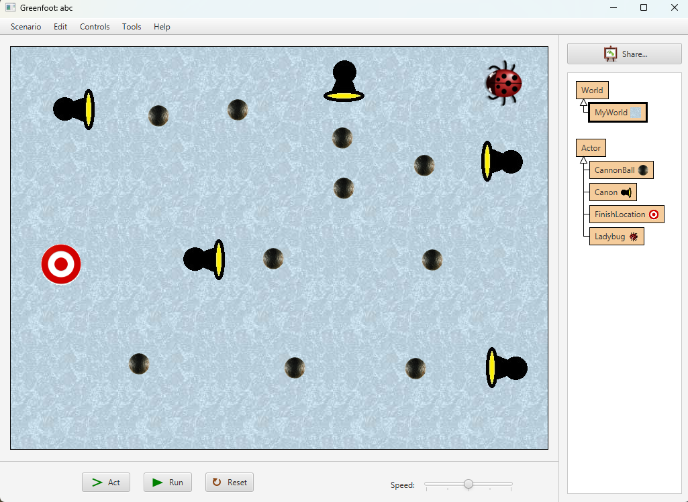

# Game Programming 1 - Final Exam

This template repository is the starter project for Game Programming 1 Final Exam. Written in Java/Stride using Greenfoot.

#### **Objective:**
Create a game in Greenfoot based on the provided screenshot. The game will feature a Ladybug navigating a grid-based world to reach the FinishLocation while avoiding Cannonballs fired by multiple Canons. The game will end with either a WinningScreen or a GameOver screen based on the player’s performance.

#### **Exam Overview:**
- **Worth:** 20% of the final grade
- **Tools:** Greenfoot IDE
- **Deadline:** Tuesday, November 19, 2024, at 10:00 AM

### **Game Requirements:**

#### 1. **World Setup:**
   - Create a new scenario and name it `MyWorld`.
   - Set up a grid with dimensions **800x600 pixels**.
   - Add a textured background of your choice to the world (similar to the provided screenshot).
   - Place the following objects in the world:
     - **Ladybug:** Positioned at the starting point.
     - **Canons:** Distribute multiple Canons across the grid, each pointing in different directions.
     - **FinishLocation:** Place this target at the opposite side of the grid from the Ladybug.
   - The layout should resemble the provided screenshot, with adequate spacing between objects.

#### 2. **Game Mechanics:**
   - **Ladybug's Movement:**
     - Allow the Ladybug to move using the arrow keys.
     - The player should guide the Ladybug through the grid while avoiding contact with Cannonballs.

   - **Canons' Behavior:**
     - Each Canon should fire Cannonballs at regular intervals.
     - Cannonballs should move in a straight line in the direction the Canon is facing.
     - Each Canon fires at a **different speed**, with some firing faster and others slower.

   - **Collision Detection:**
     - If the Ladybug collides with a Cannonball:
       - The game transitions to the **GameOver** screen.
       - The **"losing.wav"** sound is played.
     - If the Ladybug reaches the FinishLocation:
       - The game transitions to the **WinningScreen**.
       - The **"win.wav"** sound is played.

---

#### 3. **Screens and Sounds:**
   - **WinningScreen:**
     - Display a message: **"Congratulations, You Win!"**
     - Include a cheerful background.
     - Play the **"win.wav"** sound.

   - **GameOver Screen:**
     - Display a message: **"Game Over!"**
     - Include a somber background.
     - Play the **"losing.wav"** sound.

#### 4. **Sound Effects:**
   - Ensure the correct sound effects are used during the transitions:
     - **"losing.wav"** plays on GameOver.
     - **"win.wav"** plays on WinningScreen.

### **Grading Rubric:**
   - **World Setup (5%):**
     - Correctly setting up the grid, objects, and background.
   - **Game Mechanics (10%):**
     - Functional Ladybug movement, Cannonball firing, collision detection, and win/lose conditions.
   - **Screens and Sounds (3%):**
     - Proper implementation of WinningScreen/GameOver screen and sound effects.
   - **Code Quality (2%):**
     - Clear and well-documented code.

### **Good Luck!**
Test your game thoroughly to ensure all features work as expected before submission.